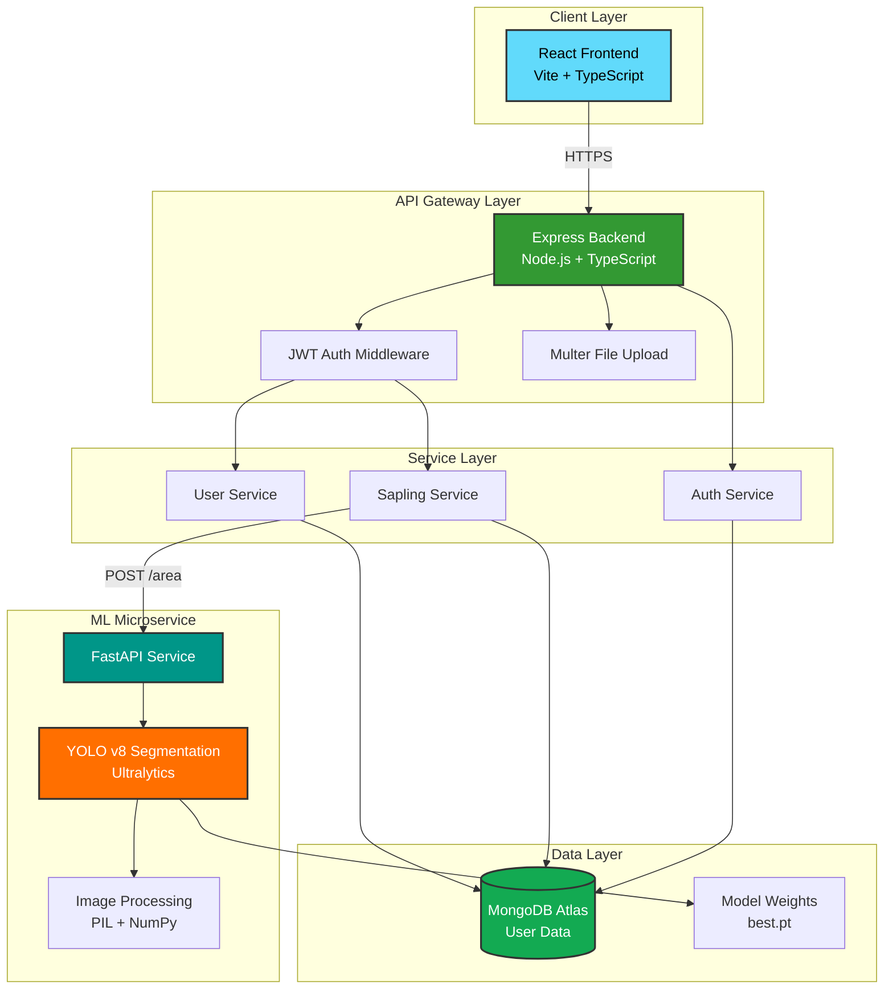
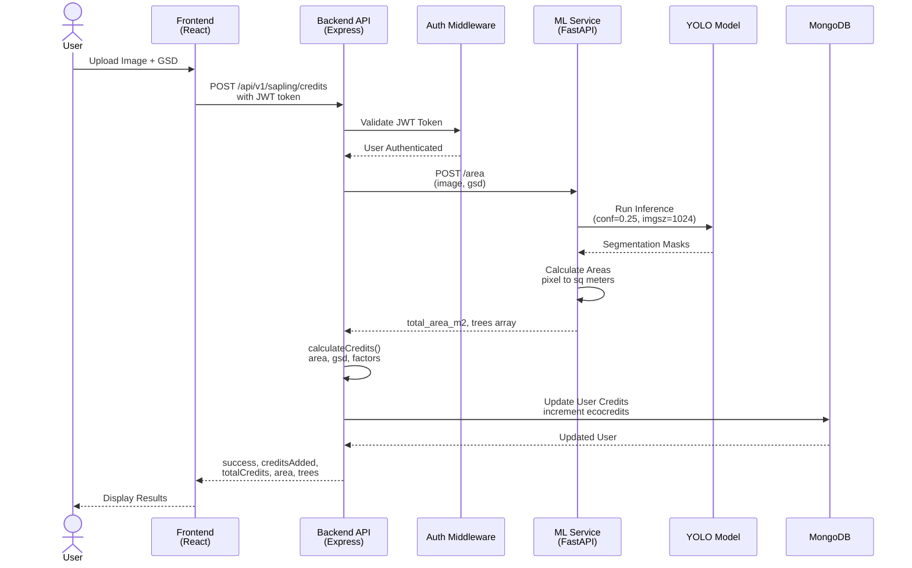
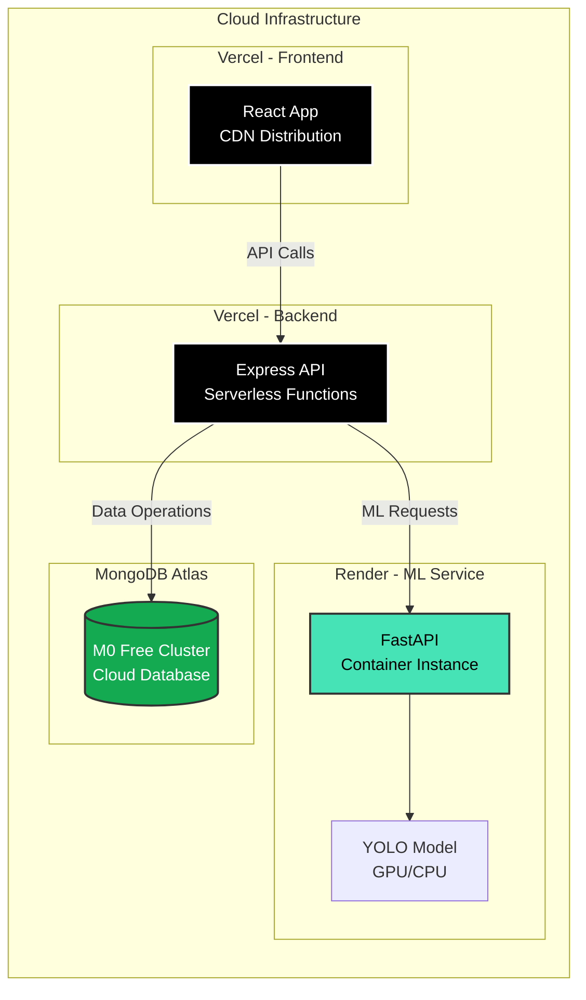
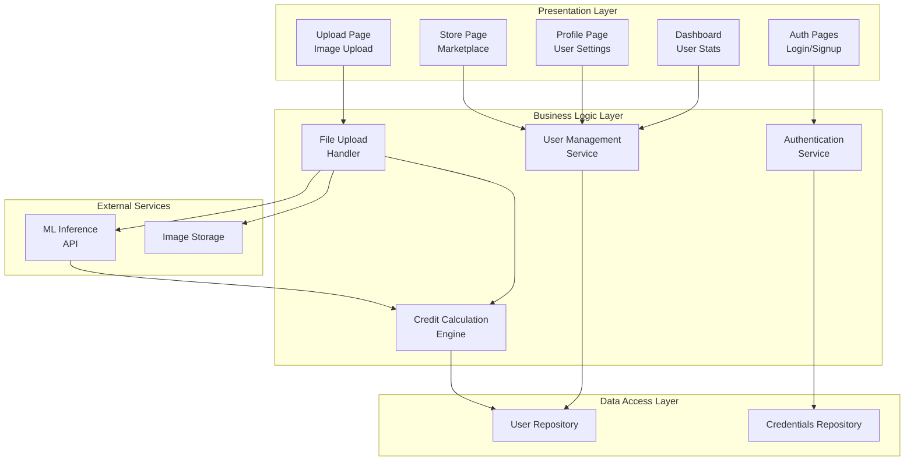
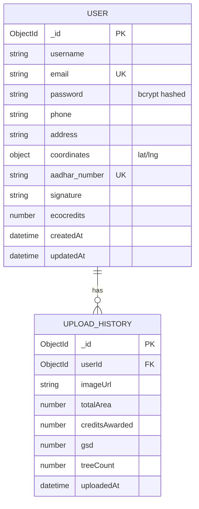
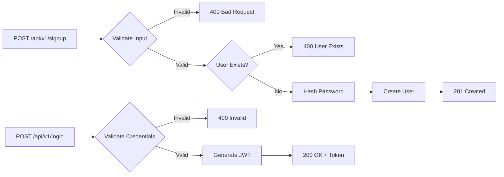
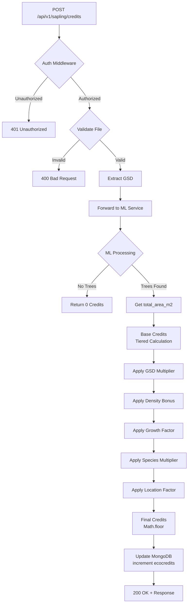
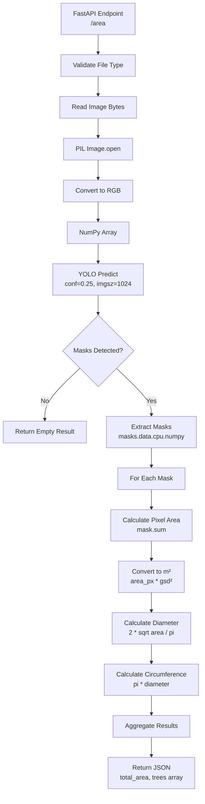
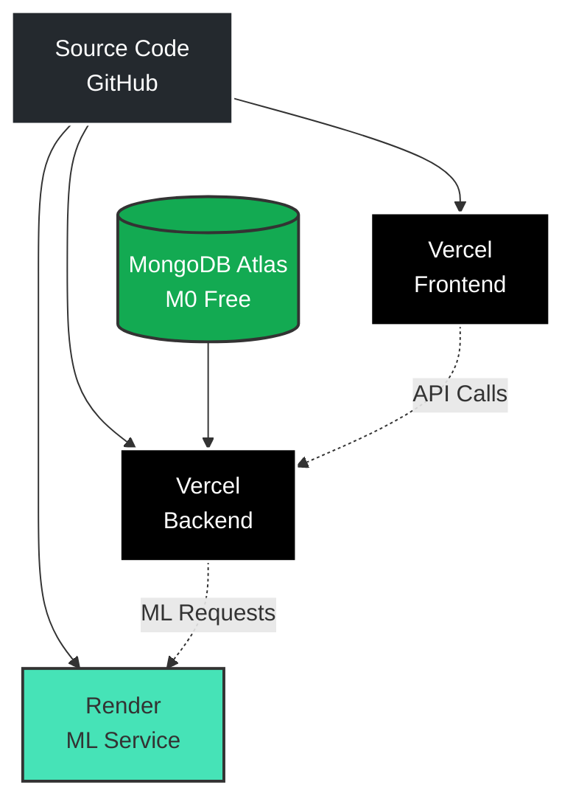

<div align="center">

# 🌳 EcoSap - Sustainable Tree Credit Platform


[](https://opensource.org/licenses/MIT)
[](https://nodejs.org/)
[](https://www.python.org/)
[](https://www.typescriptlang.org/)
[](https://reactjs.org/)
[](https://fastapi.tiangolo.com/)

**An AI-powered platform that rewards environmental conservation by calculating tree crown areas and awarding eco-credits**

[Features](#-features) • [Architecture](#-system-architecture) • [Quick Start](#-quick-start) • [Deployment](#-deployment) • [API Docs](#-api-documentation)

</div>

---

## 📋 Table of Contents

- [Overview](#-overview)
- [Features](#-features)
- [System Architecture](#-system-architecture)
- [Technology Stack](#-technology-stack)
- [High-Level Design (HLD)](#-high-level-design-hld)
- [Low-Level Design (LLD)](#-low-level-design-lld)
- [Quick Start](#-quick-start)
- [Deployment](#-deployment)
- [API Documentation](#-api-documentation)
- [Credits Calculation Algorithm](#-credits-calculation-algorithm)
- [Project Structure](#-project-structure)
- [Contributing](#-contributing)
- [License](#-license)

---

## 🌍 Overview

**EcoSap** is a comprehensive environmental conservation platform that leverages cutting-edge AI and computer vision to incentivize tree planting and maintenance. Users upload aerial/satellite images of trees, and our YOLO-based segmentation model analyzes the tree crown area to award eco-credits based on sophisticated algorithms that account for image quality, growth patterns, and environmental factors.

### 🎯 Key Objectives

- **Environmental Impact**: Encourage sustainable forestry and urban greening
- **Data-Driven Conservation**: Use AI to accurately measure and track tree health
- **Gamification**: Reward users with credits to drive behavioral change
- **Transparency**: Blockchain-ready credit system for environmental markets

---

## ✨ Features

### 🔐 User Management
- Secure JWT-based authentication
- User profiles with geolocation tracking
- Aadhar verification for identity management
- Digital signature support

### 🌲 AI-Powered Tree Analysis
- **YOLO v8 Segmentation Model** for precise tree crown detection
- Support for multiple trees in single image
- Real-time instance segmentation
- Confidence threshold: 0.25 (configurable)
- Image resolution: 1024x1024 (configurable)

### 💰 Eco-Credits System
- Advanced multi-factor credit calculation
- Ground Sample Distance (GSD) quality multipliers
- Growth tracking and comparison
- Species-specific credit multipliers
- Location-based adjustments
- Vegetation density bonuses

### 📊 Dashboard & Analytics
- User credit balance tracking
- Tree growth history
- Area calculations and metrics
- Visual analytics with charts

### 🛒 Marketplace (Planned)
- Redeem credits for sustainable products
- Carbon offset trading
- Community marketplace

---

## 🏗️ System Architecture

### High-Level Architecture Diagram



### Request Flow Diagram



### Deployment Architecture



---

## 🛠️ Technology Stack

### Frontend
| Technology | Version | Purpose |
|------------|---------|---------|
| **React** | 18.3.1 | UI Framework |
| **TypeScript** | 5.8.3 | Type Safety |
| **Vite** | 5.4.19 | Build Tool & Dev Server |
| **TailwindCSS** | 3.4.17 | Styling Framework |
| **Shadcn UI** | Latest | Component Library |
| **React Router** | 6.30.1 | Client-side Routing |
| **React Query** | 5.83.0 | Data Fetching & Caching |
| **Axios** | 1.12.2 | HTTP Client |
| **Zod** | 3.25.76 | Schema Validation |
| **Recharts** | 2.15.4 | Data Visualization |

### Backend
| Technology | Version | Purpose |
|------------|---------|---------|
| **Node.js** | 18+ | Runtime Environment |
| **Express** | 5.1.0 | Web Framework |
| **TypeScript** | 5.9.3 | Type Safety |
| **MongoDB** | 6.20.0 | Database Driver |
| **Mongoose** | 8.18.3 | ODM |
| **JWT** | 9.0.2 | Authentication |
| **Multer** | 2.0.2 | File Upload Middleware |
| **Axios** | 1.12.2 | HTTP Client |
| **Zod** | 4.1.11 | Schema Validation |
| **ESBuild** | Latest | Build Tool |

### ML Service
| Technology | Version | Purpose |
|------------|---------|---------|
| **Python** | 3.10+ | Runtime |
| **FastAPI** | Latest | Web Framework |
| **Ultralytics** | Latest | YOLO Framework |
| **PyTorch** | Latest | Deep Learning Framework |
| **NumPy** | Latest | Numerical Computing |
| **Pillow** | Latest | Image Processing |
| **Uvicorn** | Latest | ASGI Server |

---

## 📐 High-Level Design (HLD)

### System Components



### Component Responsibilities

#### 1. Frontend (React SPA)
- **Responsibilities**:
  - User interface rendering
  - Form validation and state management
  - API communication
  - Route protection and navigation
  - Image upload with preview
  - Real-time credit updates

#### 2. Backend API (Express)
- **Responsibilities**:
  - RESTful API endpoints
  - JWT-based authentication
  - Request validation (Zod schemas)
  - Database operations
  - ML service orchestration
  - Credit calculation logic
  - Error handling and logging

#### 3. ML Microservice (FastAPI)
- **Responsibilities**:
  - YOLO model inference
  - Image preprocessing
  - Instance segmentation
  - Area calculation (pixels → m²)
  - Per-tree metrics (area, diameter, circumference)
  - Health check endpoints

#### 4. Database (MongoDB)
- **Responsibilities**:
  - User data persistence
  - Credentials storage
  - Eco-credits tracking
  - Geospatial data storage
  - Timestamp management

---

## 🔍 Low-Level Design (LLD)

### Database Schema



### API Endpoints Design

#### Authentication Endpoints



#### Credit Calculation Flow



### Credit Calculation Algorithm Detail

```typescript
// Tiered base credit calculation
function calculateBaseCredits(area: number): number {
    if (area <= 10) return area * 10;
    if (area <= 50) return 100 + (area - 10) * 8;
    if (area <= 100) return 420 + (area - 50) * 6;
    if (area <= 500) return 720 + (area - 100) * 4;
    if (area <= 1000) return 2320 + (area - 500) * 2;
    return 3320 + Math.log10(area - 999) * 500;
}

// GSD quality multiplier
function getGsdMultiplier(gsd: number): number {
    if (gsd <= 0.5) return 1.5;      // High quality
    if (gsd <= 1.0) return 1.3;      // Good quality
    if (gsd <= 2.0) return 1.15;     // Medium quality
    if (gsd <= 5.0) return 1.0;      // Standard quality
    return 0.8;                      // Low quality
}

// Species multiplier map
const speciesMultipliers = {
    'oak': 1.3,
    'mangrove': 1.5,
    'pine': 1.2,
    'bamboo': 1.1,
    'default': 1.0
};
```

### ML Service Architecture



### YOLO Model Details

| Parameter | Value | Description |
|-----------|-------|-------------|
| **Model** | YOLOv8n-seg | Nano segmentation model |
| **Task** | Instance Segmentation | Tree crown detection |
| **Input Size** | 1024×1024 | High resolution for detail |
| **Confidence** | 0.25 | Detection threshold |
| **Weights** | `runs/segment/tree_crowns/weights/best.pt` | Custom trained |
| **Format** | PyTorch (.pt) | Native format |

---

## 🚀 Quick Start

### Prerequisites

Ensure you have the following installed:

- **Node.js** 18+ and npm
- **Python** 3.10+
- **Git**
- **MongoDB** (or MongoDB Atlas account)

Optional:
- `pnpm` or `yarn` for faster installs

### 1. Clone Repository

```bash
git clone <repository-url>
cd Ecosap
```

### 2. Backend Setup

```bash
cd ecosap

# Install dependencies
npm install

# Create environment file
cp .env.example .env

# Configure .env
# PORT=3000
# DB_CONN_STRING=mongodb://localhost:27017/ecosap
# JWT_SECRET=your-super-secret-key-change-this
# AREA_SERVICE_URL=http://127.0.0.1:5000/area

# Build and run
npm run dev
```

The backend will start on `http://localhost:3000`

### 3. Frontend Setup

```bash
cd ecosap_fe/sapling-earns-shop

# Install dependencies
npm install

# Create environment file
cp .env.example .env

# Configure .env
# VITE_API_BASE_URL=http://localhost:3000

# Start dev server
npm run dev
```

The frontend will start on `http://localhost:5173`

### 4. ML Service Setup

```bash
cd Yolo_model

# Create virtual environment
python -m venv .venv

# Activate virtual environment
# Windows:
.venv\Scripts\activate
# Linux/Mac:
source .venv/bin/activate

# Install dependencies
pip install -r requirements.txt

# Run the service
uvicorn api.area:app --host 0.0.0.0 --port 5000 --reload
```

The ML service will start on `http://localhost:5000`

### 5. Verify Installation

1. **ML Service Health**: Visit `http://localhost:5000/health`
2. **Backend Health**: Visit `http://localhost:3000/api/v1/health` (if implemented)
3. **Frontend**: Visit `http://localhost:5173`

---

## 📦 Deployment

### Free Tier Deployment Guide

Deploy all services using free tiers:



### 1. Database - MongoDB Atlas (Free)

1. Create account at [mongodb.com/cloud/atlas](https://www.mongodb.com/cloud/atlas)
2. Create M0 free cluster (512 MB storage)
3. Create database user
4. Whitelist IP: `0.0.0.0/0` (for serverless)
5. Get connection string: `mongodb+srv://<user>:<password>@cluster.mongodb.net/ecosap`

### 2. ML Service - Render (Free)

1. Create account at [render.com](https://render.com)
2. New Web Service → Connect GitHub repo
3. Configure:
   - **Name**: `ecosap-ml-service`
   - **Root Directory**: `Yolo_model`
   - **Environment**: `Python 3`
   - **Build Command**: `pip install -r requirements.txt`
   - **Start Command**: `uvicorn api.area:app --host 0.0.0.0 --port $PORT`
4. Environment Variables:
   ```
   MODEL_PATH=api/runs/segment/tree_crowns/weights/best.pt
   PYTHON_VERSION=3.10.0
   ```
5. Deploy → Note URL: `https://ecosap-ml-service.onrender.com`

> ⚠️ **Note**: Free tier sleeps after 15 min inactivity. First request takes 30-50s.

### 3. Backend API - Vercel (Free)

1. Create account at [vercel.com](https://vercel.com)
2. Import GitHub repo
3. Configure:
   - **Framework Preset**: Other
   - **Root Directory**: `ecosap`
   - **Build Command**: `npm run build`
   - **Output Directory**: `dist`
4. Environment Variables:
   ```
   DB_CONN_STRING=mongodb+srv://...
   JWT_SECRET=<generate-strong-secret>
   AREA_SERVICE_URL=https://ecosap-ml-service.onrender.com/area
   NODE_ENV=production
   ```
5. Deploy → Note URL: `https://ecosap-api.vercel.app`

**Alternative**: Deploy on Render as Node.js web service for persistent server.

### 4. Frontend - Vercel (Free)

1. New Project in Vercel
2. Import GitHub repo
3. Configure:
   - **Framework Preset**: Vite
   - **Root Directory**: `ecosap_fe/sapling-earns-shop`
   - **Build Command**: `npm run build`
   - **Output Directory**: `dist`
4. Environment Variables:
   ```
   VITE_API_BASE_URL=https://ecosap-api.vercel.app
   ```
5. Deploy → Note URL: `https://ecosap.vercel.app`

### Post-Deployment Checklist

- [ ] ML Service: Visit `/health` endpoint
- [ ] Backend: Test `/api/v1/health`
- [ ] Frontend: Test login/signup flow
- [ ] End-to-End: Upload test image and verify credits
- [ ] Monitor cold start times on Render
- [ ] Check MongoDB connection pooling

---

## 📚 API Documentation

### Base URLs

- **Production Backend**: `https://ecosap-api.vercel.app/api/v1`
- **Production ML**: `https://ecosap-ml-service.onrender.com`
- **Local Backend**: `http://localhost:3000/api/v1`
- **Local ML**: `http://localhost:5000`

### Authentication Endpoints

#### 1. User Signup

```http
POST /api/v1/signup
Content-Type: application/json

{
  "username": "john_doe",
  "email": "john@example.com",
  "password": "SecurePass123!",
  "phone": "+91-9876543210",
  "address": "123 Green Street, Mumbai",
  "coordinates": {
    "latitude": 19.0760,
    "longitude": 72.8777
  },
  "aadhar_number": "1234-5678-9012",
  "signature": "base64_encoded_signature",
  "ecocredits": 0
}
```

**Response** (201 Created):
```json
{
  "_id": "507f1f77bcf86cd799439011",
  "username": "john_doe",
  "email": "john@example.com",
  "ecocredits": 0,
  "createdAt": "2024-11-30T07:45:19.000Z"
}
```

#### 2. User Login

```http
POST /api/v1/login
Content-Type: application/json

{
  "email": "john@example.com",
  "password": "SecurePass123!"
}
```

**Response** (200 OK):
```json
{
  "token": "eyJhbGciOiJIUzI1NiIsInR5cCI6IkpXVCJ9..."
}
```

### Protected Endpoints

All protected endpoints require JWT token in Authorization header:

```http
Authorization: Bearer <jwt_token>
```

#### 3. Upload Image & Get Credits

```http
POST /api/v1/sapling/credits
Authorization: Bearer <jwt_token>
Content-Type: multipart/form-data

image: <file>
gsd: 0.45
```

**Form Data**:
- `image` (file): Aerial/satellite image of trees
- `gsd` (float): Ground Sample Distance in meters/pixel (default: 0.45)

**Response** (200 OK):
```json
{
  "success": true,
  "message": "Credits calculated successfully",
  "creditsAdded": 127,
  "totalCredits": 580,
  "area": {
    "totalArea": 12.45,
    "totalTrees": 3,
    "averageArea": 4.15,
    "totalCircumference": 25.68,
    "gsdUsed": 0.45,
    "trees": [
      {
        "tree_id": 1,
        "area_m2": 5.23,
        "area_px": 25844,
        "diameter_m": 2.58,
        "circumference_m": 8.11
      },
      {
        "tree_id": 2,
        "area_m2": 4.12,
        "area_px": 20296,
        "diameter_m": 2.29,
        "circumference_m": 7.19
      },
      {
        "tree_id": 3,
        "area_m2": 3.10,
        "area_px": 15259,
        "diameter_m": 1.99,
        "circumference_m": 6.25
      }
    ]
  }
}
```

**Error Response** (503 Service Unavailable):
```json
{
  "error": "ML service unavailable",
  "details": "Unable to connect to tree analysis service"
}
```

### ML Service Endpoints

#### 4. Analyze Tree Image

```http
POST /area
Content-Type: multipart/form-data

file: <image>
gsd: 0.45
```

**Response** (200 OK):
```json
{
  "success": true,
  "total_trees": 3,
  "total_area_m2": 12.45,
  "total_circumference_m": 25.68,
  "average_area_m2": 4.15,
  "gsd": 0.45,
  "image_dimensions": {
    "width": 1024,
    "height": 1024
  },
  "trees": [...]
}
```

#### 5. Health Check

```http
GET /health
```

**Response** (200 OK):
```json
{
  "status": "healthy",
  "model_loaded": true,
  "model_path": "api/runs/segment/tree_crowns/weights/best.pt"
}
```

---

## 🧮 Credits Calculation Algorithm

### Formula Overview

```
Final Credits = floor(
  BaseCredits(area) × 
  GSD_Multiplier(gsd) × 
  Density_Bonus(density) × 
  Growth_Factor(current, previous) × 
  Species_Multiplier(species) × 
  Location_Multiplier(location)
)
```

### 1. Base Credits (Tiered System)

Diminishing returns model to prevent exploitation:

```typescript
function calculateBaseCredits(area: number): number {
    if (area <= 10)    return area × 10;              // 0-10 m²
    if (area <= 50)    return 100 + (area - 10) × 8;  // 10-50 m²
    if (area <= 100)   return 420 + (area - 50) × 6;  // 50-100 m²
    if (area <= 500)   return 720 + (area - 100) × 4; // 100-500 m²
    if (area <= 1000)  return 2320 + (area - 500) × 2;// 500-1000 m²
    return 3320 + Math.log10(area - 999) × 500;       // >1000 m²
}
```

**Example**:
- 5 m² → 50 credits
- 25 m² → 220 credits
- 75 m² → 570 credits
- 250 m² → 1320 credits

### 2. GSD Quality Multiplier

Image quality affects credit value:

| GSD Range | Multiplier | Quality |
|-----------|------------|---------|
| ≤ 0.5 m/px | 1.5× | Excellent (satellite/drone) |
| ≤ 1.0 m/px | 1.3× | Good |
| ≤ 2.0 m/px | 1.15× | Medium |
| ≤ 5.0 m/px | 1.0× | Standard |
| > 5.0 m/px | 0.8× | Low quality |

### 3. Vegetation Density Bonus

Rewards dense forests:

```typescript
densityBonus = 1 + (vegetationDensity × 0.5)
// vegetationDensity: 0.0 to 1.0
```

**Example**: 
- 60% density → 1.3× multiplier

### 4. Growth Factor

Compares current vs. previous area:

```typescript
if (previousArea exists) {
    const growthRate = (currentArea - previousArea) / previousArea;
    
    if (growthRate > 0) {
        // Growth bonus (up to 30%)
        growthFactor = Math.min(1 + growthRate, 1.3);
    } else if (growthRate < -0.2) {
        // Shrinkage penalty
        growthFactor = 0.7;
    } else {
        // Minor shrinkage (within 20%)
        growthFactor = 1.0;
    }
}
```

### 5. Species Multiplier

Different tree species have different ecological value:

| Species | Multiplier | Reason |
|---------|------------|--------|
| Mangrove | 1.5× | Coastal protection, carbon sequestration |
| Oak | 1.3× | Longevity, wildlife habitat |
| Pine | 1.2× | Soil conservation |
| Bamboo | 1.1× | Fast growth, sustainability |
| Default | 1.0× | Standard trees |

### 6. Location Multiplier

Geographic factors (urban/rural, climate zone):

```typescript
locationMultiplier = getLocationMultiplier(coordinates);
// Can vary from 0.8× to 1.5× based on conservation priority
```

### Complete Example

**Scenario**: User uploads image of 3 oak trees

**Inputs**:
- Total area: 45 m²
- GSD: 0.6 m/px
- Species: Oak
- Vegetation density: 0.7 (70%)
- Previous area: 40 m²
- Location multiplier: 1.1 (urban area)

**Calculation**:
```
1. Base Credits: 100 + (45 - 10) × 8 = 380 credits
2. GSD Multiplier: 1.3 (0.6 ≤ 1.0)
3. Density Bonus: 1 + (0.7 × 0.5) = 1.35
4. Growth Factor: (45 - 40) / 40 = 0.125 → 1.125
5. Species Multiplier: 1.3 (oak)
6. Location Multiplier: 1.1

Final Credits = floor(380 × 1.3 × 1.35 × 1.125 × 1.3 × 1.1)
              = floor(1064.39)
              = 1064 credits
```

---

## 📂 Project Structure

```
Ecosap/
│
├── 📁 ecosap/                          # Backend API (Node.js + TypeScript)
│   ├── 📁 api/                         # API route handlers
│   │   └── index.ts                    # Main API entry
│   ├── 📁 middleware/                  # Express middleware
│   │   └── auth.ts                     # JWT authentication
│   ├── 📁 models/                      # Mongoose schemas
│   │   ├── users.ts                    # User model
│   │   └── sapling.data.ts             # Sapling data model
│   ├── 📁 router/                      # Route definitions
│   │   └── 📁 v1/                      # API v1 routes
│   │       ├── index.ts                # Auth routes (login/signup)
│   │       ├── user.ts                 # User management routes
│   │       └── sapling.ts              # Tree upload & credits
│   ├── 📁 services/                    # Business logic
│   │   └── database.service.ts         # Database connection
│   ├── 📁 dist/                        # Compiled JavaScript
│   ├── app.ts                          # Express app configuration
│   ├── index.ts                        # Server entry point
│   ├── script.ts                       # Utility functions (hash/compare)
│   ├── types.ts                        # Zod schemas & TypeScript types
│   ├── package.json                    # Dependencies
│   ├── tsconfig.json                   # TypeScript config
│   ├── vercel.json                     # Vercel deployment config
│   └── README.md                       # Backend documentation
│
├── 📁 ecosap_fe/                       # Frontend (React + Vite)
│   └── 📁 sapling-earns-shop/
│       ├── 📁 src/
│       │   ├── 📁 components/          # React components
│       │   │   ├── 📁 ui/              # Shadcn UI components
│       │   │   ├── Navbar.tsx          # Navigation bar
│       │   │   └── ProtectedRoute.tsx  # Auth guard
│       │   ├── 📁 contexts/            # React context providers
│       │   │   └── AuthContext.tsx     # Authentication state
│       │   ├── 📁 hooks/               # Custom React hooks
│       │   │   ├── use-mobile.tsx      # Mobile detection
│       │   │   └── use-toast.ts        # Toast notifications
│       │   ├── 📁 lib/                 # Utility libraries
│       │   │   └── utils.ts            # Helper functions
│       │   ├── 📁 pages/               # Page components
│       │   │   ├── Auth.tsx            # Login/Signup page
│       │   │   ├── Dashboard.tsx       # User dashboard
│       │   │   ├── Index.tsx           # Landing page
│       │   │   ├── Upload.tsx          # Image upload page
│       │   │   ├── Profile.tsx         # User profile
│       │   │   ├── Store.tsx           # Marketplace
│       │   │   └── NotFound.tsx        # 404 page
│       │   ├── App.tsx                 # App component & routing
│       │   ├── main.tsx                # React DOM entry
│       │   └── index.css               # Global styles
│       ├── 📁 public/                  # Static assets
│       ├── package.json                # Frontend dependencies
│       ├── vite.config.ts              # Vite configuration
│       ├── tailwind.config.ts          # Tailwind CSS config
│       ├── tsconfig.json               # TypeScript config
│       ├── vercel.json                 # Vercel deployment
│       └── README.md                   # Frontend docs
│
├── 📁 Yolo_model/                      # ML Microservice (Python)
│   ├── 📁 api/                         # FastAPI application
│   │   └── area.py                     # Main API endpoint
│   ├── 📁 runs/                        # Training artifacts
│   │   └── 📁 segment/
│   │       └── 📁 tree_crowns/
│   │           ├── 📁 weights/         # Model weights
│   │           │   └── best.pt         # Best model checkpoint
│   │           ├── results.png         # Training curves
│   │           ├── results.csv         # Metrics CSV
│   │           ├── confusion_matrix.png
│   │           └── F1_curve.png
│   ├── requirements.txt                # Python dependencies
│   ├── render.yaml                     # Render deployment config
│   └── README.md                       # ML service docs
│
├── .gitignore                          # Git ignore rules
└── README.md                           # 👈 This file
```

---

## 🔐 Security Considerations

### Authentication
- ✅ JWT tokens with 1-hour expiration
- ✅ Bcrypt password hashing
- ✅ Aadhar number for KYC verification
- 🔄 **TODO**: Implement refresh tokens
- 🔄 **TODO**: Add rate limiting

### Data Protection
- ✅ CORS configuration
- ✅ Environment variable management
- ✅ MongoDB connection string encryption
- 🔄 **TODO**: Implement HTTPS-only in production
- 🔄 **TODO**: Add input sanitization

### API Security
- ✅ File upload validation (type, size)
- ✅ Request timeout (30s)
- 🔄 **TODO**: API key authentication for ML service
- 🔄 **TODO**: Request signing

---

## 🧪 Testing

### Manual Testing

#### 1. Test Image Upload Flow

```bash
# 1. Login to get JWT token
curl -X POST http://localhost:3000/api/v1/login \
  -H "Content-Type: application/json" \
  -d '{
    "email": "test@example.com",
    "password": "TestPass123"
  }'

# 2. Upload test image
curl -X POST http://localhost:3000/api/v1/sapling/credits \
  -H "Authorization: Bearer <JWT_TOKEN>" \
  -F "image=@test_tree.jpg" \
  -F "gsd=0.45"
```

#### 2. Test ML Service Directly

```bash
# Direct ML service test
curl -X POST http://localhost:5000/area \
  -F "file=@test_tree.jpg" \
  -F "gsd=0.45"
```

### Automated Tests

```bash
# Backend tests (if implemented)
cd ecosap
npm test

# Frontend tests (if implemented)
cd ecosap_fe/sapling-earns-shop
npm test
```

---

## 🐛 Troubleshooting

### Common Issues

#### 1. ML Service Connection Refused

**Problem**: `ECONNREFUSED` error when uploading image

**Solution**:
- Verify ML service is running: `http://localhost:5000/health`
- Check `AREA_SERVICE_URL` in backend `.env`
- Ensure no firewall blocking port 5000

#### 2. MongoDB Connection Failed

**Problem**: `MongooseServerSelectionError`

**Solution**:
- Verify `DB_CONN_STRING` in `.env`
- Check MongoDB Atlas IP whitelist
- Ensure database user credentials are correct

#### 3. JWT Token Invalid

**Problem**: `401 Unauthorized` on protected routes

**Solution**:
- Check token expiration (1 hour)
- Verify `JWT_SECRET` matches between login and middleware
- Ensure `Authorization: Bearer <token>` header format

#### 4. CORS Errors

**Problem**: Browser blocks API requests

**Solution**:
- Backend CORS configured for `origin: true`
- Check frontend is making requests to correct URL
- Verify `credentials: true` in axios config

#### 5. Model Loading Error

**Problem**: YOLO model fails to load

**Solution**:
- Verify `best.pt` exists at correct path
- Check `MODEL_PATH` environment variable
- Ensure sufficient memory (model ~6MB)

---

## 🚧 Roadmap

### Phase 1 - MVP ✅
- [x] User authentication (JWT)
- [x] YOLO-based tree detection
- [x] Basic credit calculation
- [x] Image upload functionality
- [x] User dashboard

### Phase 2 - Enhanced Features 🔄
- [ ] Upload history tracking
- [ ] Growth tracking over time
- [ ] Species classification (AI)
- [ ] Batch image processing
- [ ] API rate limiting

### Phase 3 - Gamification 📋
- [ ] Leaderboards
- [ ] Achievements/badges
- [ ] Daily challenges
- [ ] Referral program
- [ ] Community features

### Phase 4 - Marketplace 📋
- [ ] Credit redemption store
- [ ] Carbon credit trading
- [ ] NFT certificates
- [ ] Partner integrations
- [ ] Donation options

### Phase 5 - Advanced AI 📋
- [ ] Tree health detection
- [ ] Disease identification
- [ ] Growth prediction ML models
- [ ] Satellite imagery integration
- [ ] Automated GSD calculation

---

## 👥 Contributing

We welcome contributions! Please follow these guidelines:

### Getting Started

1. Fork the repository
2. Create a feature branch: `git checkout -b feature/amazing-feature`
3. Commit changes: `git commit -m 'Add amazing feature'`
4. Push to branch: `git push origin feature/amazing-feature`
5. Open a Pull Request

### Code Standards

- **TypeScript**: Follow ESLint rules, use strict types
- **Python**: Follow PEP 8, use type hints
- **Commits**: Use conventional commits format
  - `feat:` new features
  - `fix:` bug fixes
  - `docs:` documentation
  - `refactor:` code refactoring
  - `test:` testing

### Pull Request Process

1. Update README.md with details of changes
2. Update API documentation if endpoints changed
3. Test all affected functionality
4. Request review from maintainers

---

## 📄 License

This project is licensed under the **MIT License**.

```
MIT License

Copyright (c) 2024 EcoSap Team

Permission is hereby granted, free of charge, to any person obtaining a copy
of this software and associated documentation files (the "Software"), to deal
in the Software without restriction, including without limitation the rights
to use, copy, modify, merge, publish, distribute, sublicense, and/or sell
copies of the Software, and to permit persons to whom the Software is
furnished to do so, subject to the following conditions:

The above copyright notice and this permission notice shall be included in all
copies or substantial portions of the Software.

THE SOFTWARE IS PROVIDED "AS IS", WITHOUT WARRANTY OF ANY KIND, EXPRESS OR
IMPLIED, INCLUDING BUT NOT LIMITED TO THE WARRANTIES OF MERCHANTABILITY,
FITNESS FOR A PARTICULAR PURPOSE AND NONINFRINGEMENT. IN NO EVENT SHALL THE
AUTHORS OR COPYRIGHT HOLDERS BE LIABLE FOR ANY CLAIM, DAMAGES OR OTHER
LIABILITY, WHETHER IN AN ACTION OF CONTRACT, TORT OR OTHERWISE, ARISING FROM,
OUT OF OR IN CONNECTION WITH THE SOFTWARE OR THE USE OR OTHER DEALINGS IN THE
SOFTWARE.
```

---

## 📞 Support & Contact

### Documentation
- **Project Repository**: (Add your GitHub URL)
- **API Documentation**: (Add Swagger/Postman link if available)
- **Wiki**: (Add wiki link if available)

### Community
- **Discord**: (Add Discord server)
- **Slack**: (Add Slack workspace)
- **Email**: support@ecosap.com

### Issues
- **Bug Reports**: Use GitHub Issues with `bug` label
- **Feature Requests**: Use GitHub Issues with `enhancement` label
- **Questions**: Use GitHub Discussions

---

## 🙏 Acknowledgments

- **Ultralytics** - YOLOv8 framework
- **MongoDB** - Database platform
- **Vercel** - Deployment platform
- **Render** - ML service hosting
- **Shadcn UI** - Component library
- **Open Source Community** - For amazing tools and libraries

---

## 📊 Project Stats


---

<div align="center">

**Made with 💚 for a greener planet**

⭐ Star this repo if you support environmental conservation!

[⬆ Back to Top](#-ecosap---sustainable-tree-credit-platform)

</div>
